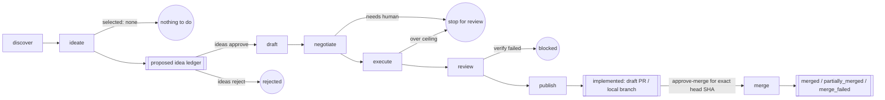

# e3d-pilot

**e3d-pilot decides what a codebase should work on next, records the idea for human approval, and only then drives approved work to a draft PR and head-SHA-bound merge.**


It is a repo-agnostic, Bash-first agentic loop: research a repository, propose durable ideas, wait for explicit implementation approval, get independent models to agree the plan is ready, hand execution to [codex-spec-runner](https://github.com/spacepacket1/codex-spec-runner) (csr), verify the result, publish a draft PR or local review branch, then wait for a separate merge approval bound to the exact reviewed PR head SHA.

## Why we built this

Autonomous coding agents solved the *execution* half of the problem: point a good model at a good spec, and it will faithfully implement it. What's still missing is everything **before** that — noticing what's worth building, making sure it isn't a rehash of a closed PR or last week's abandoned branch, and getting more than one model to actually agree the plan is safe and sound before anything touches a working tree. Skip that half and you get agents that happily reimplement existing features, argue with themselves in a PR nobody asked for, or quietly blow through a repo's real diff budget.

e3d-pilot exists to be that missing half: a small, auditable layer that sits *above* csr rather than duplicating it. csr stays the dumb, reliable phase executor — "run this spec." e3d-pilot's job is deciding what the spec should even be, proving it's worth doing, and refusing to let it run unsupervised past the point where a human needs to look.

The other reason: good ideas rarely come from staring harder at the same backlog. e3d-pilot's discover stage explicitly borrows from domains outside a repo's own category — a game's progression loop, a marketplace's liquidity trick, a social feed's notification mechanics — and its ideate stage grades every candidate on attraction and retention (does this bring people in, does it bring them back) with revenue treated as a secondary tiebreaker, never the deciding factor. The goal is features people actually want, not just the next item on an internal TODO list.

## What it does differently

- **Never repeats work.** Every idea is checked against the target repo's open branches, its PR history (open and closed), and every prior e3d-pilot run before it's allowed to proceed.
- **Never runs on one model's opinion.** The negotiate stage requires every configured reviewer — two today, more later, purely via config — to independently approve the same unchanged draft. Disagreement means bounded retries, then a clean "needs human" stop, not a forced merge.
- **Never treats absence of approval as approval.** Discovery and ideation can run unattended, but source-mutating stages require `ideas approve`, and base-branch merge requires `approve-merge` for the exact PR head SHA.
- **Never touches source before the first gate.** Execution happens in an isolated worktree on its own branch only after implementation approval. A path denylist and real post-execution diff ceilings are enforced before anything is reviewed or published.
- **Never merges a different revision.** Merge approval is separate from GitHub review approval and is bound to the observed PR URL, base branch, and head SHA. A pushed commit invalidates the approval until a human reviews and approves the new head.
- **Never assumes it's talking to spacepacket1's repos.** The entire contract with a target repository is one JSON config file. No fixed org, no fixed remote host, no `e3d-*` naming assumptions baked into the pipeline.

## How it can help others

If you maintain a repository and want a standing second opinion on "what should we build next" — one that does its homework before proposing anything, gets independent model consensus before acting, and hands you a draft PR with a full audit trail instead of a fait accompli — adopting e3d-pilot is meant to be a one-file decision: write `.e3d-pilot/config.json`, run it once to validate, then point it at your repo (or a whole fleet of them) on whatever cadence you choose (a cron entry, a scheduled job — e3d-pilot doesn't invent its own scheduler). It works identically on GitHub, on a remote-less local repo, and — architecturally, even before a forge adapter exists for it — on any other git host, because only the final publish step knows what forge it's talking to.

## Pipeline



1. **discover** — writes `findings.md`: Git history, branches, issues/PRs, existing docs and TODOs, plus a model-researched "External Context" section that includes an explicit cross-domain "Analogous Patterns" subsection (see [Ideation sourcing](#ideation-sourcing-and-scoring) below).
2. **ideate** — writes ranked, deduplicated `candidates.md` and materializes every non-duplicate candidate as a `proposed` idea. `selected: none` is a valid, clean stop when everything proposed is already covered.
3. **approval gate 1** — a human approves or rejects the exact idea. `proposed` never means rejected, and no source-mutating stage can run without current implementation approval.
4. **draft** — turns the approved candidate into a csr-shaped `spec-draft.md`, with machine-readable `pilot:touches` annotations per phase so later guards can check real paths instead of guessing from prose.
5. **negotiate** — every configured reviewer must approve the same unchanged draft in one pass; disagreement drives bounded revision rounds, ending in `spec-final.md` on success or a clean "needs human" stop.
6. **execute** — hands `spec-final.md` to csr inside an isolated worktree on its own branch, then enforces `protected_paths` and the real post-execution `max_diff_files`/`max_diff_lines` ceilings.
7. **review** — runs (or auto-detects) verification commands and asks an independent review provider to inspect the actual diff.
8. **publish** — only after verification passes: commits the run's audit artifacts to the branch and hands off to a publish backend (`github` or `local`) to open a draft PR or leave a local review branch.
9. **approval gate 2** — a human runs `approve-merge` after reviewing the draft PR/local branch. For GitHub targets, e3d-pilot records the current PR head SHA and refuses to merge any later head without a new approval.

Generated run artifacts live under `.e3d-pilot/runs/<run-id>/` in the *target* repository. Idea ledger state lives under `.e3d-pilot/ideas/<idea-id>/idea.json`, with append-only events in `.e3d-pilot/events.jsonl`. `idea.json` is derived from events and can be rebuilt; `events.jsonl` is the immutable audit source. `discover` and `all` without `--run-id` start a new, collision-safe run-id and update `.e3d-pilot/latest-run`; every other stage resumes that latest run-id unless you pass `--run-id <id>` explicitly. Create `.e3d-pilot/paused` in a target repo to stop stages before any external work happens.

## Ideation sourcing and scoring

Discover's model call doesn't just summarize "state of the art" — it's asked to pick the 2-3 most transferable entries from a configurable `analogy_domains` list (or a sensible built-in default spanning games, social platforms, marketplaces, dev tools, and fintech) and name, concretely, how each mechanic could apply to *this* repo.

Ideate then scores every non-duplicate candidate on `Attraction` and `Retention` (1-5 each), tags a `Category` (data, workflow, social, gamification, testing, marketing, selling, or other), cites the `Analogy` it drew on, and estimates `Effort`. Ranking is driven primarily by `Attraction + Retention`; an optional `Revenue` score can only break ties between otherwise-equal candidates — it can never outrank a candidate that attracts or retains users better. That priority order is deliberate: growing and keeping users is the point, revenue is a secondary outcome of doing that well.

### Revenue-focused runs

Pass `--focus revenue` to `e3d-pilot run` (any stage) to flip that priority for a dedicated pass: `discover` adds a `### Monetization Signals` subsection (existing monetization mechanisms in the repo, plus 2-3 adjacent-industry models that could extend them), and `ideate` ranks candidates by `Revenue` first — `Attraction`/`Retention` only break ties, and `Revenue` becomes a required numeric field instead of an optional tiebreaker. Candidates may be net-new monetization surfaces, not just extensions of existing features; duplicate-checking still applies equally either way.

Focus is resolved once per run and persisted to `.e3d-pilot/runs/<run-id>/focus`, so a later stage of the same run (e.g. a standalone `--stage ideate` invocation after `discover` already ran) inherits it automatically unless `--focus` is passed again explicitly, which overwrites it. Default behavior (`--focus default`, i.e. attraction/retention-first) is unchanged.

## Requirements and installation

Install Bash, Git, `jq`, `curl`, and `codex-spec-runner`; install and authenticate whichever model CLIs and forge CLI your configuration uses. Add this repository's `bin` directory to `PATH`:

```bash
git clone https://github.com/spacepacket1/e3d-pilot.git
export PATH="$PWD/e3d-pilot/bin:$PATH"
e3d-pilot --help
```

Node.js is only needed for the optional `e3d-pilot web` dashboard (see [Web UI](#web-ui-optional) below) — every other command needs only Bash, Git, `jq`, and `curl`.

## Configure a repository

Create `.e3d-pilot/config.json` in the target repository. Start from [`examples/sample-config.json`](examples/sample-config.json). The fields are:

- `verify`: commands run in the execution worktree before publish. An empty list is auto-detected from `package.json`, `requirements.txt`, or `Makefile`.
- `protected_paths`: globs that generated specs and execute-time guards reject.
- `research_topics`: hints for discovery research.
- `analogy_domains`: optional cross-domain seed list for discovery's analogy pass (see above); falls back to a built-in default when omitted.
- `providers`: provider names for `discover`, `ideate`, `draft`, ordered `negotiate` reviewers, and independent `review`.
- `max_diff_files` and `max_diff_lines`: actual post-execution ceilings.
- `docs`: optional guidance-document path; otherwise common filenames are detected.
- `live_verify`: optional `{ "command": "..." }` hook. It runs only when repository docs identify a supported E3D paid-API surface and `e3d-agent` is available; otherwise it is skipped.
- `pr`: `base_branch`, draft flag, labels, and backend (`auto`, `github`, or `local`).
- `notify`: optional `{ "email": { "to": "...", "command": "..." } }`. See [Notifications](#notifications).
- `approval`: optional `{ "implementation_required": bool, "merge_required": bool }`. Both default to `true`; see [Approval-gated operator workflow](#approval-gated-operator-workflow).
- `tracking`: optional `{ "project_url": "..." }`. Overrides `E3D_PILOT_TRACKING_PROJECT_URL` for this repo; see [Project board tracking](#project-board-tracking).

Validate and run:

```bash
e3d-pilot config validate /path/to/repository
e3d-pilot run --repo /path/to/repository --stage all
```

## Approval-gated operator workflow

The default `run --stage all` discovers and ideates autonomously, materializes ideas, then stops before `draft` unless the selected idea already has current implementation approval. This is a successful waiting state, not a crash.

List and inspect proposed ideas:

```bash
e3d-pilot ideas list --repo /path/to/repository --status proposed
e3d-pilot ideas show --repo /path/to/repository idea-abc123def456
```

Approve or reject implementation:

```bash
e3d-pilot ideas approve --repo /path/to/repository idea-abc123def456 --actor you@example.com --note "Build this next"
e3d-pilot ideas reject  --repo /path/to/repository idea-abc123def456 --reason "Not aligned this cycle" --actor you@example.com
```

`ideas approve` is the first gate. It authorizes drafting, negotiation, execution, review, and publication for the exact idea content and approved target plan. It is not a GitHub PR review, and it does not authorize merge.

Implement approved ideas:

```bash
e3d-pilot ideas implement --repo /path/to/repository idea-abc123def456
e3d-pilot ideas implement-approved --repo /path/to/repository
```

Successful implementation records the run ID, branch/worktree, changed files and lines, verification results, review result, publish backend, PR URL/number, and final PR head SHA. GitHub publication creates a draft PR; local publication leaves a local review branch and summary.

`ideas implement` always starts a brand-new run and redoes draft, negotiate, and execute from scratch on retry — including when only the last stage (typically publish, e.g. a forge label that didn't exist yet) failed on an otherwise fully verified and reviewed attempt. If a specific run already got that far, resume it in place instead of paying for another draft/negotiate/execute cycle:

```bash
e3d-pilot ideas repair-run --repo /path/to/repository --run-id <run-id> [--from-stage <stage>] idea-abc123def456
```

`--from-stage` defaults to `publish`. Every stage strictly before the resume point must already have its real success artifact on disk — this can only skip work that's provably already done, never work that never happened.

After reviewing the draft PR, approve and perform merge with the second gate:

```bash
e3d-pilot ideas approve-merge --repo /path/to/repository idea-abc123def456 --actor you@example.com --note "Reviewed head"
e3d-pilot ideas merge         --repo /path/to/repository idea-abc123def456
```

`approve-merge` records the exact PR URL, base branch, and head SHA. `ideas merge` refreshes forge state immediately before merging and refuses stale heads, changed base branches, draft PRs, closed PRs, or missing approvals. A GitHub review approval is useful social evidence, but it is not an e3d-pilot merge approval.

Request changes, sync forge state, and record outcomes:

```bash
e3d-pilot ideas request-changes --repo /path/to/repository idea-abc123def456 --reason "Tighten scope"
e3d-pilot ideas sync            --repo /path/to/repository
e3d-pilot ideas outcome         --repo /path/to/repository idea-abc123def456 --window 7d --metric retained=true --metric revenue=42
e3d-pilot ideas rebuild         --repo /path/to/repository
```

`sync` observes PR head changes, draft/ready changes, checks, closures, and external merges without approving anything. A new PR head invalidates merge approval. `outcome` appends typed metrics; it never overwrites history. `rebuild` rematerializes derived `idea.json` snapshots from `events.jsonl`.

## Migration

Existing `.e3d-pilot/runs/<run-id>/` artifacts remain readable. A legacy selected candidate can be materialized as a `proposed` idea by rerunning ideation for that run:

```bash
e3d-pilot run --repo /path/to/repository --stage ideate --run-id <legacy-run-id>
```

That command may create a proposed idea record, but it never creates implementation approval. A human must still run `ideas approve`.

Existing open e3d-pilot PRs should be adopted only through an explicit adoption command when one is available for your installed version. Adoption must record provenance for the PR/run, start the idea at `implemented`, and still require `approve-merge` before any base-branch merge. Do not treat an open PR, a GitHub review approval, or a branch name as ledger approval.

## Providers and negotiation

Built-in adapters are `claude`, `codex`, `local`, and `devin`; check them with `e3d-pilot providers list`.

**devin** — shells out to the Devin CLI in non-interactive print mode. Defaults to `claude-sonnet-4-6-thinking-1m`; override with environment variables:

```bash
export DEVIN_BIN=devin                          # binary path (default: devin)
export DEVIN_MODEL=claude-sonnet-4-6-thinking-1m  # model override
export DEVIN_PERMISSION_MODE=auto               # permission mode (default: auto)
```

**local** — calls an OpenAI-compatible endpoint. Useful for a self-hosted model (e.g. Qwen via Ollama) as a third negotiate reviewer:

```bash
export LOCAL_MODEL_ENDPOINT=http://localhost:11434/v1
export LOCAL_MODEL_NAME=my-model
```

Then add `"local"` anywhere in `providers.negotiate`; reviewer count is not hardcoded. A configured unavailable reviewer fails fast and is never silently skipped.

Every real call through the local adapter serializes through a machine-wide lock (a `mkdir`-based mutex at `${TMPDIR:-/tmp}/e3d-pilot-qwen.lock`, override with `LOCAL_MODEL_LOCK_DIR`) so that two e3d-pilot runs — even against different target repos, from cron or fleet mode — never hit a shared local model endpoint at the same moment. This matters because a local endpoint is typically one memory-resident model process backing multiple repos' agents; concurrent requests to it risk OOM, not just contention. A run waits up to `LOCAL_MODEL_LOCK_TIMEOUT` seconds (default 900) for the lock before failing; a stale lock left by a killed process is detected and reclaimed automatically.

A negotiate reviewer that omits the optional `reason:` field gets a synthesized `"(no reason provided by reviewer)"` rather than failing the parse — small models that produce a valid `status:` line but drop the reason field are tolerated.

The execute stage is intentionally limited to providers supported by `codex-spec-runner`—currently Codex and Claude. Adding local execution requires a separate csr enhancement; e3d-pilot never emits `runner:model=local` today.

## Publishing

`auto` selects `github` for a `github.com` origin and `local` otherwise. GitHub pushes only the run branch and calls `gh pr create --draft`; it never merges or pushes the base branch. Local commits the worktree branch without network access and writes `publish-summary.md`. The scripts in `lib/publish/` share the extension seam for a future GitLab backend.

Only after verification passes, publish force-adds findings, candidates, negotiation log, final spec, and csr manifest under the run's audit path so summary links resolve on the branch. Labels configured in `pr.labels` are applied to the GitHub PR at creation time.

## Notifications

Once a run publishes — a new branch (and, on GitHub, a draft PR) now exists and is ready for a human to look at — e3d-pilot can send a best-effort email so you don't have to go check. It's opt-in: add `notify.email` to the target repo's config and nothing else changes.

```json
"notify": {
  "email": {
    "to": "you@example.com"
  }
}
```

The email's subject names the branch (and calls out when the outcome `needs-attention`, e.g. no `gh` available for a GitHub repo); the body is the PR URL or local branch/path followed by the same summary that goes into the PR body — findings excerpt, the selected candidate and why it wasn't a duplicate, the negotiation outcome, and links to every audit artifact.

By default it shells out to `mail -s "$E3D_PILOT_EMAIL_SUBJECT" "$E3D_PILOT_EMAIL_TO"` with the body on stdin. Override `notify.email.command` to use `sendmail`, `msmtp`, or a script that calls SES/SendGrid/etc. — same env vars, any transport:

```json
"notify": {
  "email": {
    "to": "you@example.com",
    "command": "msmtp \"$E3D_PILOT_EMAIL_TO\""
  }
}
```

If `notify` is absent, or no mail command is configured or found on `PATH`, publish still succeeds — the notification step degrades to a no-op (or a one-line warning) rather than failing the run.

## Project board tracking

Ideas otherwise only live in the local ledger (`ideas list`/`show`) until they reach a PR — there's no visibility into what's proposed or approved unless someone goes and asks. Point e3d-pilot at a GitHub Projects (v2) board and it keeps a card for every idea in sync with its actual lifecycle status, from the moment it's proposed through merge:

| Idea status | Board column |
| --- | --- |
| `proposed` | Backlog |
| `approved_for_implementation`, `changes_requested`, `implementation_failed` | Ready |
| `implementing` | In progress |
| `implemented`, `approved_for_merge`, `partially_merged`, `merge_failed` | In review |
| `merged` | Done |
| `rejected`, `closed`, `reverted` | archived (not deleted) |

It's opt-in and off by default. Set it once for every repo via an environment variable (same shape as `LOCAL_MODEL_ENDPOINT` — one setting, everywhere):

```bash
export E3D_PILOT_TRACKING_PROJECT_URL="https://github.com/users/<owner>/projects/<n>"
```

or per-repo in `.e3d-pilot/config.json` (overrides the env var for that repo):

```json
"tracking": {
  "project_url": "https://github.com/orgs/<org>/projects/<n>"
}
```

A proposed idea gets a draft card. Once it reaches a real PR, e3d-pilot reuses an existing board item for that PR if one is already there — including one a project's own "auto-add" workflow created — rather than leaving a stale draft alongside it. Every sync is best-effort: a misconfigured URL, missing `project`/`read:project` `gh` auth scope, or a transient API error degrades to a stderr warning, never a failed command. Tracking state is recorded as part of the same append-only ledger everything else uses, so `ideas rebuild` never loses which board item an idea is linked to.

## Fleet mode

Provide a JSON array of repository paths:

```bash
e3d-pilot fleet examples/sample-fleet.json
```

Each repository runs independently. Fleet continues after failures, prints a per-repository result and final totals, and exits nonzero if any repository failed.

### Cross-repo ideation

`e3d-pilot fleet <repos.json>` is deliberately blind to opportunities that span repos — each one runs its own isolated pipeline. `e3d-pilot fleet discover` is the complement: a single portfolio-level discover+ideate pass across every repo in the fleet file at once, looking specifically for ideas that only make sense because 2+ of those repos exist together (e.g. one repo's data feed combined with another's payment rails). It never proposes anything that a single repo could do alone — that's what regular `fleet`/`run` are for.

```bash
e3d-pilot fleet discover examples/sample-fleet.json
e3d-pilot fleet discover examples/sample-fleet.json --focus revenue
```

It needs its own small config — just `providers.discover` and `providers.ideate` (see [`examples/sample-fleet-config.json`](examples/sample-fleet-config.json)) — at `.e3d-pilot-fleet/config.json` next to the fleet file, or pass `--config <path>` to point elsewhere. Output lands under `.e3d-pilot-fleet/runs/<run-id>/findings.md` and `candidates.md`, mirroring the single-repo run layout: `findings.md` has a per-repo `## Portfolio` digest (README/AGENTS/CLAUDE content, head sha) and a model-researched `## Cross-Repo Context` section; `candidates.md` ranks candidates the same way single-repo `ideate` does, except every candidate must name 2 or more repos in a `Repos:` field, and dedup is checked only against prior `fleet discover` runs in the same workspace — not against each individual repo's own branches or PRs, which is a real scope limit worth knowing about.

This stage stops after materializing fleet ideas in `.e3d-pilot-fleet/ideas/`, with events in `.e3d-pilot-fleet/events.jsonl`. Cross-repo implementation still requires explicit approval:

```bash
e3d-pilot fleet ideas examples/sample-fleet.json list --status proposed
e3d-pilot fleet ideas examples/sample-fleet.json show idea-abc123def456
e3d-pilot fleet ideas examples/sample-fleet.json approve idea-abc123def456 --actor you@example.com
e3d-pilot fleet ideas examples/sample-fleet.json implement idea-abc123def456
e3d-pilot fleet ideas examples/sample-fleet.json implement-approved
```

A fleet idea records ordered per-repo targets at approval time. Targets are implemented sequentially. If some targets merge and a later target fails or changes, the fleet idea becomes `partially_merged`; e3d-pilot records which repositories merged and which did not. It never claims cross-repo atomicity.

## Reviewing fleet improvements

After a fleet run, `fleet prs` gives you a terminal view of open e3d-pilot draft PRs across repos. Use it for visibility, not as the approval workflow:

```bash
e3d-pilot fleet prs ~/e3d-fleet.json
```

```
repo                    PR     state  idea                                          A   R   effort
────────────────────────────────────────────────────────────────────────────────────────────────
e3d-docs                #1     DRAFT  In-docs "Ask the Docs" AI assistant           5   5   high
e3d-sdk                 #1     DRAFT  MCP-native tool bindings for AI agents        5   4   high
e3d-trade               #1     DRAFT  Trade Decision Receipts                       4   5   medium
  └─ https://github.com/spacepacket1/e3d-sdk/pull/1
```

If `~/e3d-fleet.json` exists it is used by default; pass an explicit path otherwise.

Recommended fleet approvals use the idea ledger:

```bash
e3d-pilot fleet ideas ~/e3d-fleet.json approve-merge idea-abc123def456 --actor you@example.com
e3d-pilot fleet ideas ~/e3d-fleet.json merge idea-abc123def456
e3d-pilot fleet ideas ~/e3d-fleet.json merge-approved
```

`fleet ideas approve` is implementation approval. `fleet ideas approve-merge` is merge approval for the exact reviewed head SHA. A GitHub review approval or `fleet prs --approve` action must not be treated as either ledger approval.

## Web UI (optional)

`fleet prs` and `ideas list` cover the terminal; `e3d-pilot web` is an optional dashboard for reviewing and deciding on ideas across one or more repos in a browser, for anyone who's fine adding Node.js for it. It is not required — every other e3d-pilot command needs only Bash, Git, `jq`, and `curl`, and `e3d-pilot web` refuses to start with a clear error if Node isn't on `PATH`.

```bash
export E3D_PILOT_WEB_AUTH_USER=you
export E3D_PILOT_WEB_AUTH_PASS='a real secret, not this'
e3d-pilot web --repo /path/to/repo-a --repo /path/to/repo-b --port 4173
```

Open `http://127.0.0.1:4173` (basic auth, the credentials above) to see every configured repo's own idea ledger merged into one filterable list, and a detail page per idea with its summary, scores, dedup rationale, approval/merge state, event history, linked run artifacts, and action buttons (approve, reject, request changes, approve-merge, sync, implement). Every action is a thin, synchronous shell-out to the exact same `e3d-pilot ideas ...` subcommand you'd type yourself — the web UI never reimplements ledger or approval logic, so it can never drift from the CLI's guarantees.

Clicking **Implement** spawns `e3d-pilot ideas implement` as a detached background process (draft → negotiate → execute → review → publish can take 30+ minutes) and the idea page live-tails its `implementation-stage-log.md` while it runs.

Both `E3D_PILOT_WEB_AUTH_USER` and `E3D_PILOT_WEB_AUTH_PASS` are required; there is no unauthenticated mode. This is meant to run on a trusted machine or behind your own reverse proxy/tunnel — it has no built-in TLS, rate limiting, or multi-user accounts.

## Running on a schedule

e3d-pilot is deliberately not a daemon — every invocation is a single, short-lived CLI call that runs (or resumes) a stage and exits. There's no built-in scheduler, so "continuous" is up to whatever calls it: cron, a systemd timer, a scheduled CI workflow, or your own orchestrator all work equally well.

Separate autonomous ideation from approved implementation, sync, and dataset export. For example:

```cron
# Autonomous single-repo ideation; stops before implementation approval.
0 */6 * * * /path/to/e3d-pilot/bin/e3d-pilot run --repo /path/to/repo --stage all --focus revenue >> /var/log/e3d-pilot-ideate.log 2>&1

# Implement only ideas that humans already approved.
15 * * * * PATH="/usr/local/bin:$PATH" /path/to/e3d-pilot/bin/e3d-pilot ideas implement-approved --repo /path/to/repo >> /var/log/e3d-pilot-implement.log 2>&1

# Observe forge state and invalidate stale merge approvals.
*/30 * * * * PATH="/usr/local/bin:$PATH" /path/to/e3d-pilot/bin/e3d-pilot ideas sync --repo /path/to/repo >> /var/log/e3d-pilot-sync.log 2>&1

# Weekly labeled dataset export for local Qwen evaluation/training.
0 3 * * 1 /path/to/e3d-pilot/bin/e3d-pilot fleet train export /path/to/fleet.json >> /var/log/e3d-pilot-export.log 2>&1
```

Fleet equivalents:

```cron
0 2 * * * PATH="/usr/local/bin:$PATH" LOCAL_MODEL_ENDPOINT="http://127.0.0.1:5050/v1" /path/to/e3d-pilot/bin/e3d-pilot fleet discover /path/to/fleet.json --focus revenue >> /var/log/e3d-pilot-fleet-ideate.log 2>&1
20 * * * * PATH="/usr/local/bin:$PATH" /path/to/e3d-pilot/bin/e3d-pilot fleet ideas /path/to/fleet.json implement-approved >> /var/log/e3d-pilot-fleet-implement.log 2>&1
*/30 * * * * PATH="/usr/local/bin:$PATH" /path/to/e3d-pilot/bin/e3d-pilot fleet ideas /path/to/fleet.json sync >> /var/log/e3d-pilot-fleet-sync.log 2>&1
```

A nonzero exit can mean a real failure, or a legitimate stop (`ideate`'s "nothing to do," a `negotiate` deadlock needing human input, a failed `verify`) — check `.e3d-pilot/runs/<run-id>/` in the target repo before treating it as a crash. Drop a `.e3d-pilot/paused` file in a target repo to make the scheduled job a no-op without touching the crontab.

## Weekly exports

Use fleet training commands to aggregate the fleet ledger plus every repo ledger named by the fleet file:

```bash
e3d-pilot fleet train readiness /path/to/fleet.json --since 2026-08-01T00:00:00Z
e3d-pilot fleet train export    /path/to/fleet.json --week 2026-W32
```

Exports write `ideation.jsonl`, `preferences.jsonl`, `implementation.jsonl`, and `manifest.json` under `.e3d-pilot-fleet/datasets/<YYYY-Www>/` by default. Pending ideas may be exported as unlabeled ideation records, never as rejected examples. Explicit approvals, rejections, changes requested, failures, merges, partial merges, closures, reversions, and typed outcomes provide the labels.

## Safety model

Discovery and ideation do not mutate source. Draft, negotiate, execute, review, and publish require current implementation approval. Execution uses a separate worktree and per-run branch. Protected paths are checked both when drafting and immediately before csr. Actual file/line ceilings stop before review. Failed verification blocks publish. Publication opens a draft PR or local review branch.

Merge is a separate operation. `approve-merge` binds approval to the observed target set and exact PR head SHA. Merge refuses stale heads, changed base branches, draft PRs, closed PRs, missing approvals, and unsupported local merge backends. e3d-pilot never force-pushes or pushes directly to a protected base branch.

Project board tracking (see above) is best-effort and never in the safety path: it's off unless explicitly configured, and a misconfigured URL, missing `gh` auth scope, or transient API failure degrades to a stderr warning rather than blocking ideate, approve, implement, or merge.

The optional web UI (see above) adds no new authority of its own: every action it exposes is a direct shell-out to the same `e3d-pilot ideas ...` subcommand, so the same approval gates, transition guards, and merge-SHA binding apply identically regardless of whether a decision came from a terminal or a browser.

Run the repository test suite with:

```bash
set -e
for test_file in tests/phase{1..22}.sh; do bash "$test_file"; done
```
