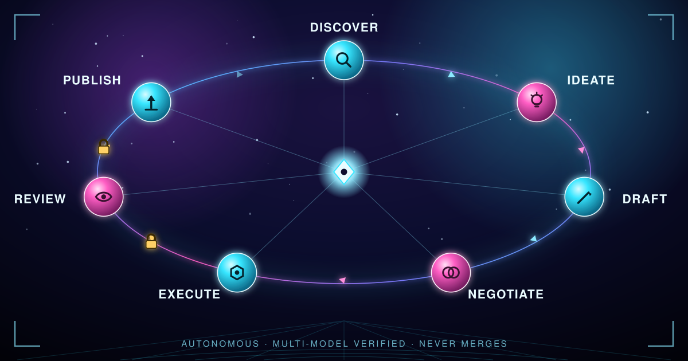
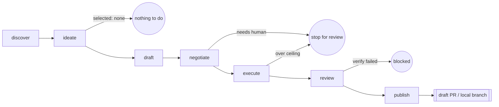

# e3d-pilot

**e3d-pilot decides what a codebase should work on next, and drives that idea safely to a reviewable branch — unattended, but never unsupervised.**



It is a repo-agnostic, Bash-first agentic loop: research a repository, propose an idea, check it hasn't already been done, get independent models to agree the plan is ready, hand execution to [codex-spec-runner](https://github.com/spacepacket1/codex-spec-runner) (csr), verify the result, and stop at a draft PR or a local review branch. It never merges anything itself.

## Why we built this

Autonomous coding agents solved the *execution* half of the problem: point a good model at a good spec, and it will faithfully implement it. What's still missing is everything **before** that — noticing what's worth building, making sure it isn't a rehash of a closed PR or last week's abandoned branch, and getting more than one model to actually agree the plan is safe and sound before anything touches a working tree. Skip that half and you get agents that happily reimplement existing features, argue with themselves in a PR nobody asked for, or quietly blow through a repo's real diff budget.

e3d-pilot exists to be that missing half: a small, auditable layer that sits *above* csr rather than duplicating it. csr stays the dumb, reliable phase executor — "run this spec." e3d-pilot's job is deciding what the spec should even be, proving it's worth doing, and refusing to let it run unsupervised past the point where a human needs to look.

The other reason: good ideas rarely come from staring harder at the same backlog. e3d-pilot's discover stage explicitly borrows from domains outside a repo's own category — a game's progression loop, a marketplace's liquidity trick, a social feed's notification mechanics — and its ideate stage grades every candidate on attraction and retention (does this bring people in, does it bring them back) with revenue treated as a secondary tiebreaker, never the deciding factor. The goal is features people actually want, not just the next item on an internal TODO list.

## What it does differently

- **Never repeats work.** Every idea is checked against the target repo's open branches, its PR history (open and closed), and every prior e3d-pilot run before it's allowed to proceed.
- **Never runs on one model's opinion.** The negotiate stage requires every configured reviewer — two today, more later, purely via config — to independently approve the same unchanged draft. Disagreement means bounded retries, then a clean "needs human" stop, not a forced merge.
- **Never touches anything irreversibly.** Execution happens in an isolated worktree on its own branch. A path denylist and real post-execution diff ceilings are enforced before anything is reviewed, let alone published. Publish itself only ever opens a draft PR or commits a local review branch — no merges, no force-pushes, no pushes to a protected branch, ever.
- **Never assumes it's talking to spacepacket1's repos.** The entire contract with a target repository is one JSON config file. No fixed org, no fixed remote host, no `e3d-*` naming assumptions baked into the pipeline.

## How it can help others

If you maintain a repository and want a standing second opinion on "what should we build next" — one that does its homework before proposing anything, gets independent model consensus before acting, and hands you a draft PR with a full audit trail instead of a fait accompli — adopting e3d-pilot is meant to be a one-file decision: write `.e3d-pilot/config.json`, run it once to validate, then point it at your repo (or a whole fleet of them) on whatever cadence you choose (a cron entry, a scheduled job — e3d-pilot doesn't invent its own scheduler). It works identically on GitHub, on a remote-less local repo, and — architecturally, even before a forge adapter exists for it — on any other git host, because only the final publish step knows what forge it's talking to.

## Pipeline



1. **discover** — writes `findings.md`: Git history, branches, issues/PRs, existing docs and TODOs, plus a model-researched "External Context" section that includes an explicit cross-domain "Analogous Patterns" subsection (see [Ideation sourcing](#ideation-sourcing-and-scoring) below).
2. **ideate** — writes ranked, deduplicated `candidates.md`. Every candidate states plainly whether it duplicates an existing branch, PR, or past run; `selected: none` is a valid, clean stop when everything proposed is already covered.
3. **draft** — turns the selected candidate into a csr-shaped `spec-draft.md`, with machine-readable `pilot:touches` annotations per phase so later guards can check real paths instead of guessing from prose.
4. **negotiate** — every configured reviewer must approve the same unchanged draft in one pass; disagreement drives bounded revision rounds, ending in `spec-final.md` on success or a clean "needs human" stop.
5. **execute** — hands `spec-final.md` to csr inside an isolated worktree on its own branch, then enforces `protected_paths` and the real post-execution `max_diff_files`/`max_diff_lines` ceilings.
6. **review** — runs (or auto-detects) verification commands and asks an independent review provider to inspect the actual diff.
7. **publish** — only after verification passes: commits the run's audit artifacts to the branch and hands off to a publish backend (`github` or `local`) to open a draft PR or leave a local review branch.

Generated state lives entirely under `.e3d-pilot/runs/<run-id>/` in the *target* repository — inspectable, git-ignorable, safe to delete and regenerate. `discover` and `all` without `--run-id` start a new, collision-safe run-id and update `.e3d-pilot/latest-run`; every other stage resumes that latest run-id unless you pass `--run-id <id>` explicitly to resume a specific one. Create `.e3d-pilot/paused` in a target repo to stop stages before any external work happens.

## Ideation sourcing and scoring

Discover's model call doesn't just summarize "state of the art" — it's asked to pick the 2-3 most transferable entries from a configurable `analogy_domains` list (or a sensible built-in default spanning games, social platforms, marketplaces, dev tools, and fintech) and name, concretely, how each mechanic could apply to *this* repo.

Ideate then scores every non-duplicate candidate on `Attraction` and `Retention` (1-5 each), tags a `Category` (data, workflow, social, gamification, testing, marketing, selling, or other), cites the `Analogy` it drew on, and estimates `Effort`. Ranking is driven primarily by `Attraction + Retention`; an optional `Revenue` score can only break ties between otherwise-equal candidates — it can never outrank a candidate that attracts or retains users better. That priority order is deliberate: growing and keeping users is the point, revenue is a secondary outcome of doing that well.

## Requirements and installation

Install Bash, Git, `jq`, `curl`, and `codex-spec-runner`; install and authenticate whichever model CLIs and forge CLI your configuration uses. Add this repository's `bin` directory to `PATH`:

```bash
git clone https://github.com/spacepacket1/e3d-pilot.git
export PATH="$PWD/e3d-pilot/bin:$PATH"
e3d-pilot --help
```

## Configure a repository

Create `.e3d-pilot/config.json` in the target repository. Start from [`examples/sample-config.json`](examples/sample-config.json). The fields are:

- `verify`: commands run in the execution worktree before publish. An empty list is auto-detected from `package.json`, `requirements.txt`, or `Makefile`.
- `protected_paths`: globs that generated specs and execute-time guards reject.
- `research_topics`: hints for discovery research.
- `analogy_domains`: optional cross-domain seed list for discovery's analogy pass (see above); falls back to a built-in default when omitted.
- `providers`: provider names for `discover`, `ideate`, `draft`, ordered `negotiate` reviewers, and independent `review`.
- `max_diff_files` and `max_diff_lines`: actual post-execution ceilings.
- `docs`: optional guidance-document path; otherwise common filenames are detected.
- `live_verify`: optional `{ "command": "..." }` hook. It runs only when repository docs identify a supported E3D paid-API surface and `e3d-agent` is available; otherwise it is skipped.
- `pr`: `base_branch`, draft flag, labels, and backend (`auto`, `github`, or `local`).
- `notify`: optional `{ "email": { "to": "...", "command": "..." } }`. See [Notifications](#notifications).

Validate and run:

```bash
e3d-pilot config validate /path/to/repository
e3d-pilot run --repo /path/to/repository --stage all
```

## Providers and negotiation

Built-in adapters are `claude`, `codex`, and `local`; check them with `e3d-pilot providers list`. The local adapter needs an OpenAI-compatible endpoint:

```bash
export LOCAL_MODEL_ENDPOINT=http://localhost:11434/v1
export LOCAL_MODEL_NAME=my-model
```

Then add `"local"` anywhere in `providers.negotiate`; reviewer count is not hardcoded. A configured unavailable reviewer fails fast and is never silently skipped.

Every real call through the local adapter serializes through a machine-wide lock (a `mkdir`-based mutex at `${TMPDIR:-/tmp}/e3d-pilot-qwen.lock`, override with `LOCAL_MODEL_LOCK_DIR`) so that two e3d-pilot runs — even against different target repos, from cron or fleet mode — never hit a shared local model endpoint at the same moment. This matters because a local endpoint is typically one memory-resident model process backing multiple repos' agents; concurrent requests to it risk OOM, not just contention. A run waits up to `LOCAL_MODEL_LOCK_TIMEOUT` seconds (default 900) for the lock before failing; a stale lock left by a killed process is detected and reclaimed automatically.

The execute stage is intentionally limited to providers supported by `codex-spec-runner`—currently Codex and Claude. Adding local execution requires a separate csr enhancement; e3d-pilot never emits `runner:model=local` today.

## Publishing

`auto` selects `github` for a `github.com` origin and `local` otherwise. GitHub pushes only the run branch and calls `gh pr create --draft`; it never merges or pushes the base branch. Local commits the worktree branch without network access and writes `publish-summary.md`. The scripts in `lib/publish/` share the extension seam for a future GitLab backend.

Only after verification passes, publish force-adds findings, candidates, negotiation log, final spec, and csr manifest under the run's audit path so summary links resolve on the branch.

## Notifications

Once a run publishes — a new branch (and, on GitHub, a draft PR) now exists and is ready for a human to look at — e3d-pilot can send a best-effort email so you don't have to go check. It's opt-in: add `notify.email` to the target repo's config and nothing else changes.

```json
"notify": {
  "email": {
    "to": "you@example.com"
  }
}
```

The email's subject names the branch (and calls out when the outcome `needs-attention`, e.g. no `gh` available for a GitHub repo); the body is the PR URL or local branch/path followed by the same summary that goes into the PR body — findings excerpt, the selected candidate and why it wasn't a duplicate, the negotiation outcome, and links to every audit artifact.

By default it shells out to `mail -s "$E3D_PILOT_EMAIL_SUBJECT" "$E3D_PILOT_EMAIL_TO"` with the body on stdin. Override `notify.email.command` to use `sendmail`, `msmtp`, or a script that calls SES/SendGrid/etc. — same env vars, any transport:

```json
"notify": {
  "email": {
    "to": "you@example.com",
    "command": "msmtp \"$E3D_PILOT_EMAIL_TO\""
  }
}
```

If `notify` is absent, or no mail command is configured or found on `PATH`, publish still succeeds — the notification step degrades to a no-op (or a one-line warning) rather than failing the run.

## Fleet mode

Provide a JSON array of repository paths:

```bash
e3d-pilot fleet examples/sample-fleet.json
```

Each repository runs independently. Fleet continues after failures, prints a per-repository result and final totals, and exits nonzero if any repository failed.

## Running on a schedule

e3d-pilot is deliberately not a daemon — every invocation is a single, short-lived CLI call that runs (or resumes) a stage and exits. There's no built-in scheduler, so "continuous" is up to whatever calls it: cron, a systemd timer, a scheduled CI workflow, or your own orchestrator all work equally well.

A daily cron entry running a whole fleet at 6am, logging output and exit status:

```cron
0 6 * * * PATH="/usr/local/bin:$PATH" /path/to/e3d-pilot/bin/e3d-pilot fleet /path/to/fleet.json >> /var/log/e3d-pilot.log 2>&1
```

Or a single repository, on its own config-driven cadence:

```cron
0 */6 * * * /path/to/e3d-pilot/bin/e3d-pilot run --repo /path/to/repo --stage all >> /var/log/e3d-pilot.log 2>&1
```

A nonzero exit can mean a real failure, or a legitimate stop (`ideate`'s "nothing to do," a `negotiate` deadlock needing human input, a failed `verify`) — check `.e3d-pilot/runs/<run-id>/` in the target repo before treating it as a crash. Drop a `.e3d-pilot/paused` file in a target repo to make the scheduled job a no-op without touching the crontab.

## Safety model

Execution uses a separate worktree and per-run branch. Protected paths are checked both when drafting and immediately before csr. Actual file/line ceilings stop before review. Failed verification blocks publish. Publication is draft/local only, with no merge, force-push, or direct base-branch push.

Run the repository test suite with:

```bash
for test_file in tests/*.sh; do bash "$test_file"; done
```
